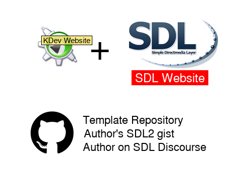

KDev heavy Template
===================

This is a C-SDL Template for KDevelop

[Simple DirectMedia Layer](https://www.libsdl.org/) is a cross-platform development library designed to provide low level access to audio, keyboard, mouse, joystick, and graphics hardware via OpenGL and Direct3D.  

This is a small SDL2 Demo and it does demonstrate how...  

  * to load and use a Window Icon
  * to set up a window and a renderer
  * to load and render textures with dest rects
  * do conditional Rendering
  * check point in Rect intersection
  * check point in Circle intersection
  * to play a sound chunk and set it's volume
  * to play/pause/halt music, set it's volume
  * to open links
  * to ask for and respond to key/mouse events
  * to create tooltips  

**Screenshot:**  

**Useful links:**  
[SDL2-C-Tutorials](https://acry.github.io/) | [SDL2](https://www.libsdl.org/) | [SDL-Discourse](https://discourse.libsdl.org)  

**Assets:**  
Fonts:  
[NimbusSanL-Regular](https://fontlibrary.org/en/font/nimbus-sans-l)  
[Iconfont](https://fontawesome.com)  

Music:  
Title: "Wish You Were Here"
Artist: THE.MADPIX.PROJECT  
[source](https://licensing.jamendo.com/de/track/1214935/wish-you-were-here)

**Contact**
[Get in touch on SDL-Discourse](https://discourse.libsdl.org/u/Acry/summary)
